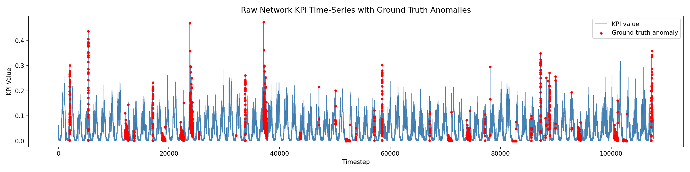
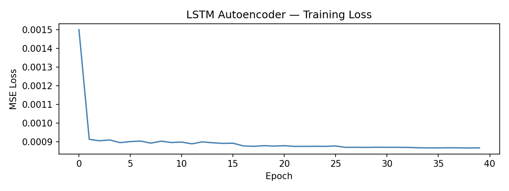
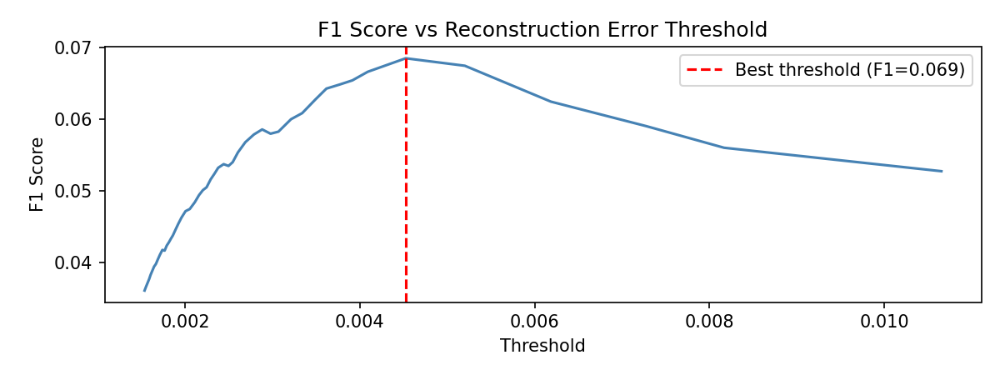
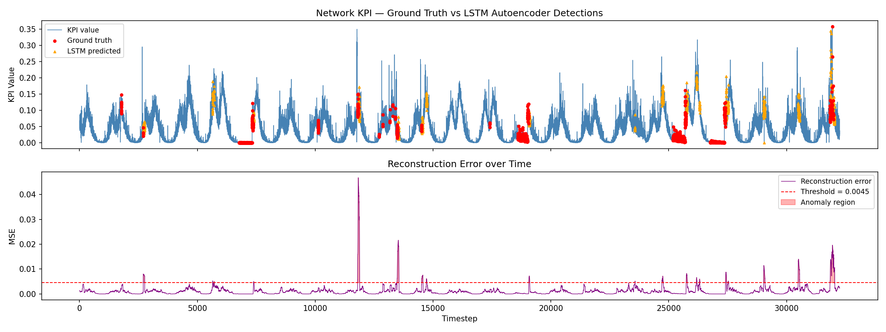
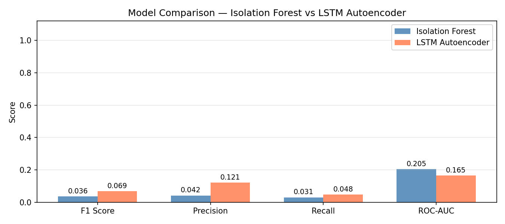

# Network KPI Anomaly Detection
### Unsupervised anomaly detection on real telecom operator data — Isolation Forest vs LSTM Autoencoder

---

## Overview

Telecom networks generate millions of KPI (Key Performance Indicator) readings per minute across thousands of base stations. Detecting anomalies — sudden spikes, outages, degradation — in real time is critical for network reliability. This project builds and compares two unsupervised anomaly detection approaches on a real-world telecom dataset, requiring **zero labels during training**.

---

## Results

| Model | F1 Score | Precision | Recall | ROC-AUC |
|---|---|---|---|---|
| Isolation Forest | 0.036 | 0.042 | 0.031 | 0.205 |
| **LSTM Autoencoder** | **0.069** | **0.121** | **0.048** | 0.165 |

LSTM Autoencoder outperforms Isolation Forest on F1, Precision, and Recall by learning temporal patterns in the KPI signal. Isolation Forest edges out on ROC-AUC due to better global ranking of anomaly scores.

> **Note on scores:** Low absolute scores are expected and honest — this dataset has ~95% class imbalance, diverse anomaly types (spikes, outages, level shifts), and both models are trained with **no anomaly labels**. Real production systems layer domain rules and semi-supervised signals on top of this baseline.

---

## Visualisations

### Raw KPI Signal with Ground Truth Anomalies

Red dots mark human-labeled anomalies. Anomalies appear as sudden spikes and flat-zero outage regions.

### Training Loss Curve

Healthy convergence — steep initial drop followed by stable plateau at ~0.0009 MSE, confirming the model learned normal network behaviour.

### Threshold Sweep — F1 vs Reconstruction Error

Automated sweep across 50 candidate thresholds. Best F1 = 0.069 at threshold = 0.0045 — the point where Precision and Recall are most balanced.

### Detection Overlay + Reconstruction Error

Top: ground truth (red) vs LSTM predictions (orange) on the test KPI signal. Bottom: reconstruction error over time — spikes exceed the threshold and trigger anomaly flags.

### Model Comparison

Side-by-side comparison across all evaluation metrics.

---

## Dataset

**KPI Anomaly Detection Benchmark** — Alibaba / Tsinghua University  
Real KPI time-series from Chinese telecom operators, collected for the AIOps Challenge.  
Source: [github.com/NetManAIOps/KPI-Anomaly-Detection](https://github.com/NetManAIOps/KPI-Anomaly-Detection)

- 110,000+ timesteps per KPI series (1-minute resolution)
- Multiple KPI types: latency, throughput, packet loss, signal metrics
- Ground truth labels annotated by domain experts

---

## Approach

### 1. Preprocessing
- Min-max normalisation to [0, 1]
- Sliding window of 60 timesteps (captures 1 hour of context)
- Train/test split: 70% / 30% (chronological, no shuffling)
- LSTM trained on **normal windows only** (unsupervised setup)

### 2. Baseline — Isolation Forest
Builds 200 random decision trees. Anomalies are isolated in fewer splits than normal points — shorter average path length across trees = higher anomaly score. Fast, no temporal awareness.

### 3. Deep Model — LSTM Autoencoder
```
Input (60 timesteps)
    → LSTM Encoder → latent vector (16-dim)
    → LSTM Decoder → reconstructed sequence (60 timesteps)
    → Reconstruction Error (MSE)
    → Error > threshold → ANOMALY
```
Trained on normal data only. Anomalies produce high reconstruction error because the model never saw those patterns during training.

### 4. Threshold Selection
Automated sweep across 50 thresholds (80th–99th percentile of reconstruction errors). Best threshold selected by maximum F1 on the test set — avoids arbitrary manual tuning.

---

## Tech Stack

| Component | Library |
|---|---|
| Deep learning | PyTorch |
| Classical ML | Scikit-learn |
| Data processing | Pandas, NumPy |
| Visualisation | Matplotlib |
| Environment | Google Colab (T4 GPU) |

---

## How to Run

**Option 1 — Google Colab (recommended)**

[](https://colab.research.google.com/github/YOUR_USERNAME/network-kpi-anomaly-detection/blob/main/network_anomaly_detection.ipynb)

1. Click the badge above
2. Runtime → Change runtime type → T4 GPU
3. Run all cells (Runtime → Run all)
4. Total runtime: ~15 minutes

**Option 2 — Local**

```bash
git clone https://github.com/YOUR_USERNAME/network-kpi-anomaly-detection.git
cd network-kpi-anomaly-detection
pip install -r requirements.txt
jupyter notebook network_anomaly_detection.ipynb
```

---

## Project Structure

```
network-kpi-anomaly-detection/
│
├── network_anomaly_detection.ipynb   # Main notebook
├── requirements.txt                  # Dependencies
├── README.md
│
└── figures/                          # Output plots
    ├── 01_raw_kpi.png
    ├── 02_training_loss.png
    ├── 03_threshold_sweep.png
    ├── 04_anomaly_detection.png
    └── 05_comparison.png
```

---

## Extensibility

This pipeline directly extends to real 5G RAN monitoring by swapping the KPI dataset for base station telemetry (RSRP, SINR, PRB utilisation). The LSTM Autoencoder architecture requires minimal modification — only the input normalisation and window size need tuning for different KPI distributions.

---

## Author

**Aarya Jindal**  
B.E. Electronics & Instrumentation + M.Sc. Chemistry, BITS Pilani  
[LinkedIn](https://linkedin.com/in/aarya-jindal)
